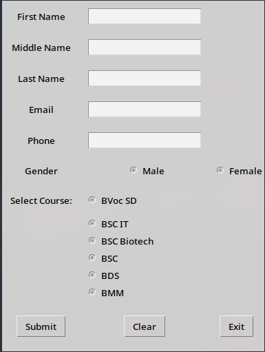

# Registration Form using Tkinter and MySQL

## Description
This is a simple GUI-based registration form built using Python's Tkinter library. The form collects user details and stores them in a MySQL database.

## Features
- User-friendly GUI for data entry.
- Validates phone numbers (must be 10 digits).
- Stores user information in a MySQL database.
- Options to clear fields and exit the application.

## Prerequisites
Ensure you have the following installed:
- Python 3.x
- MySQL server
- Required Python libraries:
  ```bash
  pip install mysql-connector-python
  ```

## Database Setup
1. Create a MySQL database:
   ```sql
   CREATE DATABASE user_data;
   ```
2. Create a table to store user information:
   ```sql
   CREATE TABLE users (
       id INT AUTO_INCREMENT PRIMARY KEY,
       first_name VARCHAR(50),
       middle_name VARCHAR(50),
       last_name VARCHAR(50),
       email VARCHAR(100),
       phone VARCHAR(10),
       gender VARCHAR(10),
       selected_course VARCHAR(50)
   );
   ```

## Usage
1. Run the script:
   ```bash
   python registration_form.py
   ```
2. Fill in the required fields and click **Submit** to save the details.
3. Click **Clear** to reset fields.
4. Click **Exit** to close the application.

## Output


